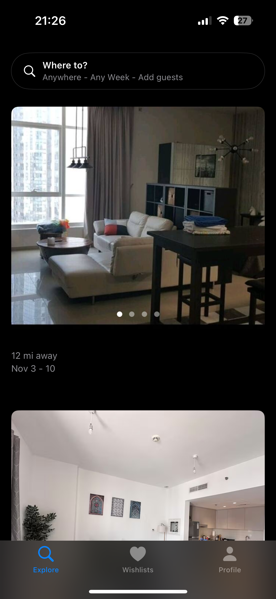
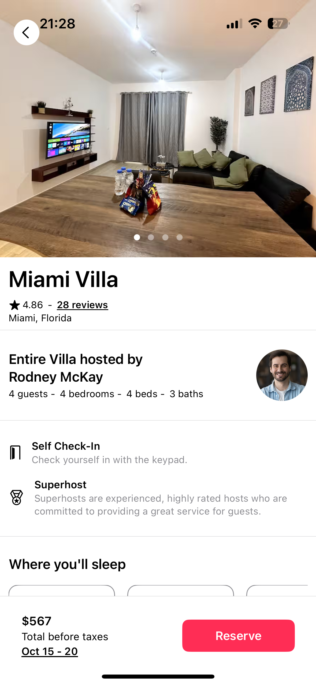
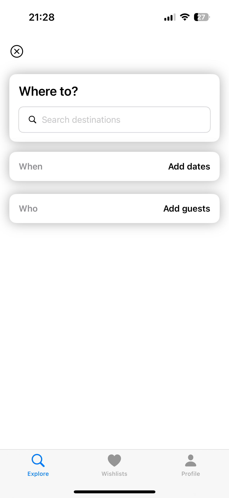

# Airbnb Clone

A simple Airbnb-inspired iOS app built with **SwiftUI**, **Maps**, and **CoreLocation**.  
This project uses **dummy data** to showcase property listings, location-based search, and map integration.

---

## Features

- **Map Integration** — Display property locations on an interactive map using **MapKit**.
- **CoreLocation** — Access and display the user’s current location.
- **Property Listings** — View details of dummy Airbnb-style listings with images, price, and location.
- **Search Functionality** — Filter listings by location or name.
- **Responsive UI** — Adaptive layout for iPhone and iPad using SwiftUI.

---

## Tech Stack

- **SwiftUI** — Declarative UI framework for building iOS apps.
- **MapKit** — Apple’s native map framework for displaying maps.
- **CoreLocation** — Access device location data.
- **Dummy Data** — Static JSON or Swift structs to simulate API data.

